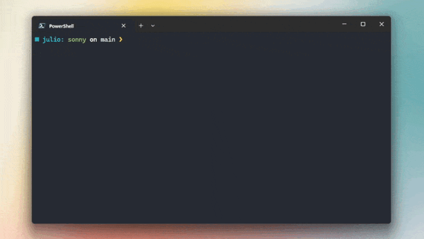

<h3 align="center">
    Sonny 🤖
</h3>

<p align="center">
  <a href="https://twitch.tv/superp0sit1on" target="_blank">Twitch</a>
  ·
  <a href="https://sonny.juliomartins.dev" target="_blank">Documentation</a>
</p>

<h6 align="center">
  	<a href="https://www.python.org">
		
	</a>
	<a href="https://heroku.com/">
		
	</a>
</h6>

<h6 align="center">
	<a href="https://github.com/Superp0sit1on/sonny/stargazers">
		
	</a>
	<a href="https://github.com/Superp0sit1on/sonny/issues">
		
	</a>
	<a href="https://github.com/Superp0sit1on/sonny/contributors">
		
	</a>
</h6>

<p align="center">
    Chatbot named and inspired by the Sonny character from the "I, Robot" movie of 2004, and used on my Twitch channel.
</p>

<p align="center">
    
</p>

&nbsp;

### ✨ Features

- **List of commands:** provide a list of available commands to the chat using !cmd.
- **Commands module:** create custom commands to interact with the chat.
- **Greetings module:** automatically welcomes viewers to the chat.
- **Pride module**: bunch of commands to celebrate the LGBTQIA+ community with their flags.
- **Stylished logs:** use colored logs to improve readability and debugging.
- **Modular design:** separate the bot's features into modules for better organization and maintenance.
- **Code formatting and linting:** maintain the codebase clean and organized using Black and iSort.
- **Environment variables:** store sensitive information in a .env file for security.
- **Heroku deployment:** deploy the chatbot to Heroku for continuous operation.
- **Documentation:** provide a detailed explanation of the chatbot's features and usage.

&nbsp;

### 🧰 Requirements

- Chatbot
	- [Python (^3.12.4)](https://www.python.org)
	- [Pipenv (^2024.0.1)](https://pipenv.pypa.io)
- Documentation
	- [Node.js (^20.14.0)](https://nodejs.org)

&nbsp;

### 🛠 Usage

1. Clone the repository:

```console
git clone https://github.com/Superp0sit1on/sonny.git
```

2. Install the dependencies:

```console
pipenv install
```

3. Create a `.env` file in the root directory with your chatbot credentials and definitions. Example:

```env
TOKEN=oauth:****
NICKNAME=s0nny_bot
CHANNELS=superp0sit1on
BOTS=streamlabs, pokemoncommunitygame
```

> [!TIP]  
> You can get your chatbot token from the [Twitch Apps TMI](https://twitchapps.com/tmi) website.

4. Run the local environment:

```console
pipenv run bot
```

> [!IMPORTANT]  
> Don't forget to grant mod privileges with `/mod nameofyourbot` to your chatbot on your Twitch channel if it runs under a different account.

&nbsp;

### 🚀 Deploy

Currently hosted on Heroku and running 24/7, you can check our [Heroku deployment documentation](https://sonny.juliomartins.dev/guide/heroku) for more info on how to deploy the chatbot to Heroku.

&nbsp;

### ✍️ Issues

Feel free to open an issue if you find a bug or have a suggestion.

> [!IMPORTANT]  
> Fill out the issue template accordingly for accurate and faster responses.

&nbsp;

### 👐 Contributing

See [CONTRIBUTING.md](CONTRIBUTING.md).

&nbsp;

###  📜 Code of Conduct

See [CODE_OF_CONDUCT.md](CODE_OF_CONDUCT.md).

&nbsp;

### 🔗 Links

- [Website](https://twitch.tv/superp0sit1on)
- [Documentation](https://sonny.juliomartins.dev)

&nbsp;

---

<p align="center">
	Copyright &copy; 2024 
	<a href="https://github.com/Superp0sit1on" target="_blank">
		Júlio Martins
	</a>
<p align="center">
	<a href="https://github.com/Superp0sit1on/sonny/blob/main/LICENSE">
		
	</a>
</p>
